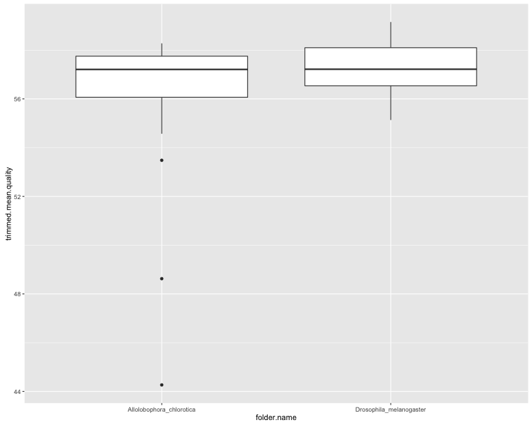
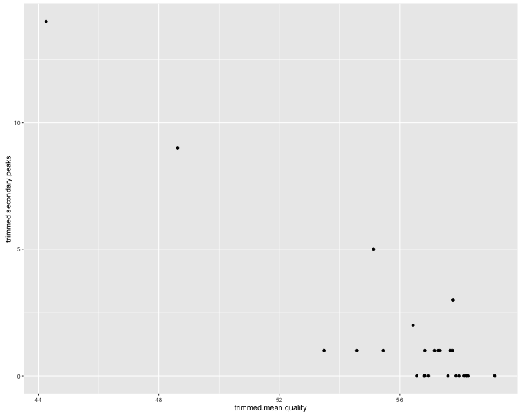

sangeranalyseR
==============
This package impelements functions to analyse Sanger sequencing reads, especially those from the ABI platform, in R.

Typical functions include:

* detecting secondary peaks in chromatograms
* merging forward and reverse sequences
* performing multiple alignments
* estimating and annotating phylogenies

-----

# Installation

### Dependencies

sangeranalyseR relies heavily on packages from CRAN and Bioconductor. If you don't already have the packages listed below, the following code will fetch them for you:

```{r eval=FALSE}
# CRAN packages
install.packages("parallel")

# Bioconductor packages
source("https://bioconductor.org/biocLite.R")
biocLite("DECIPHER")
biocLite("Biostrings")
biocLite("sangerseqR")
```

The easiest way to install sangeranalyseR is to install it straight from GitHub:

### Installing from GitHub using devtools
Run the following code from your R console:

```{r eval=FALSE}
install.packages("devtools")
library(devtools)
install_github("roblanf/sangeranalyseR")
library(sangeranalyseR)
```

### Install from zip file

A zipped version of the package is available at https://github.com/roblanf/sangeranalyseR/archive/master.zip.  To install from the zip file, download a copy of it to your system.  Once it's finished downloading, type the following (where PATH is the path to the zip file):

```{r eval=FALSE}
install.packages("devtools")
library(devtools)
install_local("PATH")
library(sangeranalyseR)
```

-----

# Using sangeranalyseR

To demonstrate the basics of using this package, I have put together some test data that comprises .ab1 sequencing files from two species. The data are publically available from http://www.boldsystems.org/, and are provided in the ```/test_data``` folder in this reposotory. 

To follow along with this tutorial, download the test data to your machine, and enter the commands below, changing the file paths to the data files and folders where necessary (I'm using a mac and put the test data in a folder called ```test_data``` on my desktop).

Throughout, I'll call a single file a 'read'. When that file represents a final sequence, I'll call it a 'sequence'. I.e. all sequences comprise one or more reads, but not all reads are sequences (e.g. when a read is just one of a large set that will be merged into a single sequence).

## Analysing a single read

### Load your read

Let's start by analysing one read. To start with, we load the read as an abif s4 object, and also convert it to a sangerseq s4 object (both are from the sangerseqR package).


```{r eval=FALSE}
# change this to point to any of the test data files you downloaded
seq.filepath = "~/Desktop/test_data/Allolobophora_chlorotica/ACHLO006-09[LCO1490_t1,HCO2198_t1]_F.ab1"
seq.abif = read.abif(seq.filepath)
seq.sanger = sangerseq(seq.abif)
```

The difference between these two objects is that the abif object contains all the raw data produced by the sequencing machine, while the sangerseq object does not. The sangerseq object can also be created from an SCF file, which has different data to a .ab1 file. This package deals only with .ab1 files. The functions in this package are written in the most general format possible, which means that some take an abif object as input, and others take a sangerseq object as input.

### Trim low quality bases from your read

This package uses Mott's modified trimming algorithm to trim off low-quality bases from your read. This algorithm scans along your sequence in a sliding window, and removes low-quality bases from the start and end. For example, we can get the positions that we should trim our sequence like this:

```{r eval=FALSE}
trims = trim.mott(seq.abif)
trims
```

This gives us a list with two entries: the start position and finish position of the trimmed sequence. To compare the trimmed and untrimmed sequence, we can do this:

```{r eval=FALSE}
seq.untrimmed = seq.abif@data$PBAS.2
seq.trimmed = substring(seq.untrimmed, trims$start, trims$finish)
```

You can control the severity of the trimming using the trim.cutoff argument. Smaller numbers indicate more severe trimming. E.g. using a cutoff of 0.00001 will trim of many more low quality bases:

```{r eval=FALSE}
trims = trim.mott(seq.abif, cutoff = 0.00001)
trims
seq.untrimmed = seq.abif@data$PBAS.2
seq.trimmed = substring(seq.untrimmed, trims$start, trims$finish)
```

### Call secondary peaks in your sequence

Secondary peaks occur where there is more than one peak at a given position in the chromatogram. These can result from seuqencing heterozygous sequences, or from sequencing a pool of sequences from different individuals. A key parameter here is how you set the ratio for calling a secondary peak, i.e. proportionally how high should the lower peak be when compared to the higher peak? A sensible (and widely used) ratio is 0.33, indicating that the lower peak should be at least 1/3rd as high as the higher peak for it count as a secondary peak. 

To find secondary peaks with default parameters, just do this:


```{r eval=FALSE}
sp = secondary.peaks(seq.sanger)
sp$secondary.peaks
sp$read
```

The function gives us a list of two things. The first is a data.frame called secondary.peaks, which shows the location and variants of each secondary peak. The second is a sangerseq s4 object that was used to call the secondary peaks. This is just the sangerseq object that was passed to the function, after having the makeBaseCalls() function from the sangerseqR package applied to it. 

We can also ask the secondary.peaks function to draw a chromatogram, so you can easily verify yourself whether you think the secondary peaks are real or just sequencing noise. To do that, we just tell it where we want the files written. I'm choosing to write them to the same folder that contains the original sequencing data. Note that this will write two files - a PDF of the chromatogram, plus a .csv file of the secondary peak locations. I also specify a file prefix so that the files will have names that match the input sequence name.

```{r eval=FALSE}
sp = secondary.peaks(seq.sanger, output.folder = "~/Desktop/test_data/Allolobophora_chlorotica", file.prefix = "ACHLO006-09[LCO1490_t1,HCO2198_t1]_F")
```

The chromatogram highlights the locations of the secondary peaks with blue bars. In this case, it's clear that the secondary peaks occur in the low-quality seuqence near the end of the read, and are probably noise rather than true secondary peaks.


### Generate a detailed summary of your sequence

The chromatogram suggests that the secondary peaks we saw occurred in noisy low-quality parts of our sequence. We might not care much about this, and instead we might care more about secondary peaks that occur in the high-quality regions of our sequence. To look at this information, we can use the ```summarise.abi.file()``` function. 

```{r eval=FALSE}
summary = summarise.abi.file(seq.abif)
summary
```

This summary shows us a lot of information, which you can unpack by looking at the documentation for the function with ```?summarise.abi.file```. For the purposes of this tutorial, it's worth noting that only one of the 3 secondary peaks falls within the trimmed sequence. Looking back at the whole chromatogram, this suggests that the default trimming cutoff of 0.05 is probably too lenient here. We might choose a more severe one, like this:

```{r eval=FALSE}
summary = summarise.abi.file(seq.abif, trim.cutoff = 0.0001)
summary
```

This gives us no secondary peaks in our trimmed sequence. Note that the trimmed seuqence is now much shorter too (462 bases with the more severe cutoff, versus 664 before). The mean quality score of the trimmed sequence is now higher of course (54.7 now, versus 53.9 before).

In general, it's possible to control exactly how trimming and secondary peak-calling is done by passing the appropriate arguments to the summarise.abi.file function. See ```?summarise.abi.file``` for details.


## Analysing lots of reads at once

Typically, in a sanger sequencing project we might generate 10s or 100s of sequencing reads. sangeranalyseR provides a convenient way to summarise all of these reads with the ```summarise.abi.folder``` function. For example, consider our test data. We have a single folder ```test_data``` which contains reads from two different species, each in its own folder. This kind of nested file organisation is both sensible and common. To get summaries of all of the reads in all of the folders, we can do this (you'll need to change the file path of course):


```{r eval=FALSE}
summaries = summarise.abi.folder("~/Desktop/test_data")
summaries
```

This gives us a data frame of summaries, one row for each read. In this case the data frame also contains the full file path, as well as the name of the read and the name of the folder that the read is in. This means we can easily make some simple plots to compare statistics, e.g.:

```
library(ggplot2)
ggplot(summaries, aes(x = folder.name, y = raw.mean.quality)) + geom_boxplot()
```


```
ggplot(summaries, aes(x = folder.name, y = trimmed.mean.quality)) + geom_boxplot()
```


```
ggplot(summaries, aes(x = folder.name, y = trimmed.secondary.peaks)) + geom_boxplot()
```


```
ggplot(summaries, aes(x = trimmed.mean.quality, y = trimmed.secondary.peaks)) + geom_point()
```



The first two plots show clearly that the trimming improves the per-base quality scores. The third plot shows that most sequences have very few secondary peaks in the trimmed sequence, although there are some (quite serious) outliers. The final plot shows that the secondary peaks tend to be called in the lower-quality seuqences.

